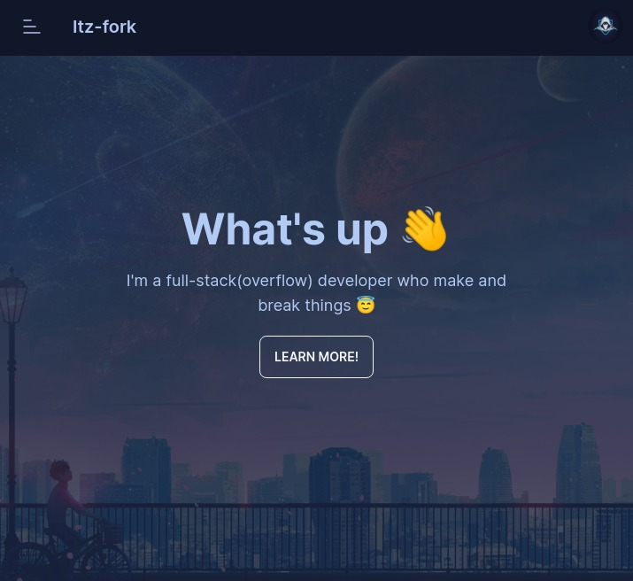

# Sveltefolio 🦊

<p align="center">
    
    </br>
    <a href="https://github.com/Itz-fork">Itz-fork</a>'s simple portfolio made with sveltekit (<a href="https://itz-fork.vercel.app/">Demo</a>)
</p>

---

## Run locally 💻
```bash
git clone https://github.com/Itz-fork/Sveltfolio.git
cd Sveltfolio
pnpm i
pnpm run dev
```

### Deploy ☁️

- Install [vercel cli](https://vercel.com/cli)
- Then change directory to 'Sveltefolio' and run
```sh
# Sets-up a new vercel project for the first time
vercel

# Deploys app to production
vercel --prod
```

## Used packages 📦
- UI components - [Daisy UI](https://github.com/saadeghi/daisyui)
- Other styles - [Tailwind](http://tailwindcss.com/)
- Smooth scrolling - [svelte-scrolling](https://github.com/valmisson/svelte-scrolling)
- Scroll animations used in languages section - [saos](https://github.com/shiryel/saos)
- Theme changer - [theme-change](https://github.com/saadeghi/theme-change)


## Credits ❤️
- Images(programming languages) - [wikimedia](https://commons.wikimedia.org/)
- Icons used - [Iconoir](https://iconoir.com/)
- Background image(hero) credits goes to respective original artist